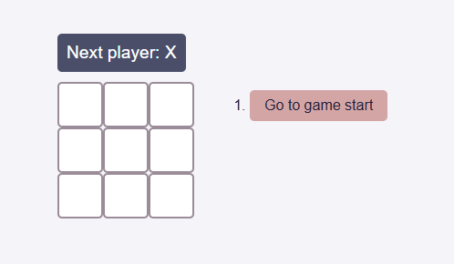
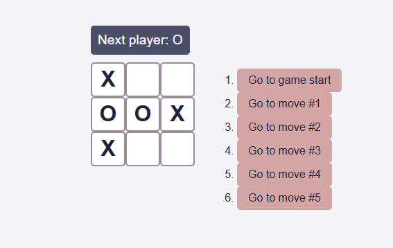
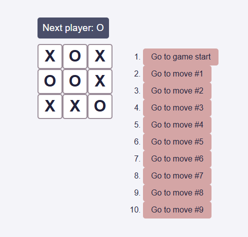

# ❌⭕ React Tic-Tac-Toe  

A **React.js-based** implementation of the classic **Tic-Tac-Toe** game, developed as an **interactive learning project** following the official **React.js "Getting Started" tutorial**. This project demonstrates **core React concepts**, including **state management, component composition, and event handling**, while incorporating **modern CSS for styling and responsive layout design**.  

## 🎯 Features  

- **Dynamic Game Board** – Players take turns marking `X` or `O` on a 3x3 grid.  
- **Move History Navigation** – Jump back to previous game states and replay moves.  
- **Winner Detection** – Built-in logic to determine the winner or a draw.  
- **React State Management** – Uses React hooks for handling game logic efficiently.  
- **Responsive & Styled UI** – Modern CSS ensures a clean and mobile-friendly interface.  

## 🛠️ Technologies Used  

- **React.js** – Core framework for UI and game logic.  
- **CSS** – Styling for an engaging and intuitive experience.  

## 📸 Screenshots  

### Homepage  


### Gameplay
  

### Endgame
  

## 🚀 Installation & Setup  

1. Clone the repository:  
   ```bash
   git clone https://github.com/vladig98/TicTacToe-React.git
   cd TicTacToe-React
   ```  
2. Install dependencies:  
   ```bash
   npm install
   ```  
3. Build the app
   ```bash
   npm run build
   ```
4. Start the development server:  
   ```bash
   npm run preview
   ```  

## 🎮 How to Play  

1. **Click on a square** to place your mark (`X` or `O`).  
2. Players **take turns** until a winner is determined or the board is full.  
3. The **winner is highlighted** if three marks align horizontally, vertically, or diagonally.  
4. Use the **Move History** to navigate back to previous turns.  
5. Click **Restart** to begin a new game.  

## 🛠️ Contributing  

Contributions are welcome! Feel free to **fork** the repository, create a **new branch**, and submit a **pull request**.  

## 📄 License  

This project is licensed under the **MIT License**.  

---

**❌⭕ Challenge your friends and experience React in action! 🚀**  